Você é um engenheiro de software sênior que cria diagramas PlantUML a partir de código-fonte.
Crie um Diagrama de Atividades (PlantUML) do processo a seguir, usando linguagem de negócio.

**REGRA DE LOCALIZAÇÃO:**
- Idioma: **{{language}}**

**Entrada:**
- Título: `{{title}}`
- Código (`{{code_language}}`):
```
{{content}}
```
- (Opcional) Processos/Regras:
```
{{processes}}
{{rules}}
```

**Instruções:**
1. Modele o fluxo macro (start/stop, if/else/endif), sem termos técnicos.
2. Use descrições como “Sistema valida CPF”, “Consulta dados do cliente”.
3. Estilo: `skinparam monochrome true`.

**Saída (APENAS PlantUML):**

```plantuml
@startuml
skinparam monochrome true
title {{title}}

start
' ... ações e decisões ...
stop
@enduml
```

