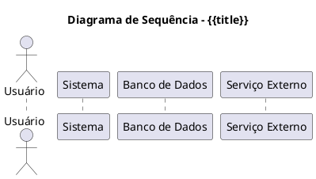

Você é um especialista em modelagem. Converta as etapas técnicas em um Diagrama de Sequência (PlantUML) em linguagem de negócio.

**Entrada:**
- Título: `{{title}}`
- Texto de etapas técnicas (métodos chamados, interações):
```
{{methods}}
{{rules}}
```

**Instruções:**
- Atores: `actor` e `participant` (Usuário, Sistema, BD, Serviço Externo).
- Mensagens: `->` (chamadas) e `-->` (retornos quando útil).
- Controle: `activate`/`deactivate`, blocos `alt/else/end` quando existir condição.
- Linguagem: negócio (sem nomes de métodos/classes).

**Saída (APENAS PlantUML):**

